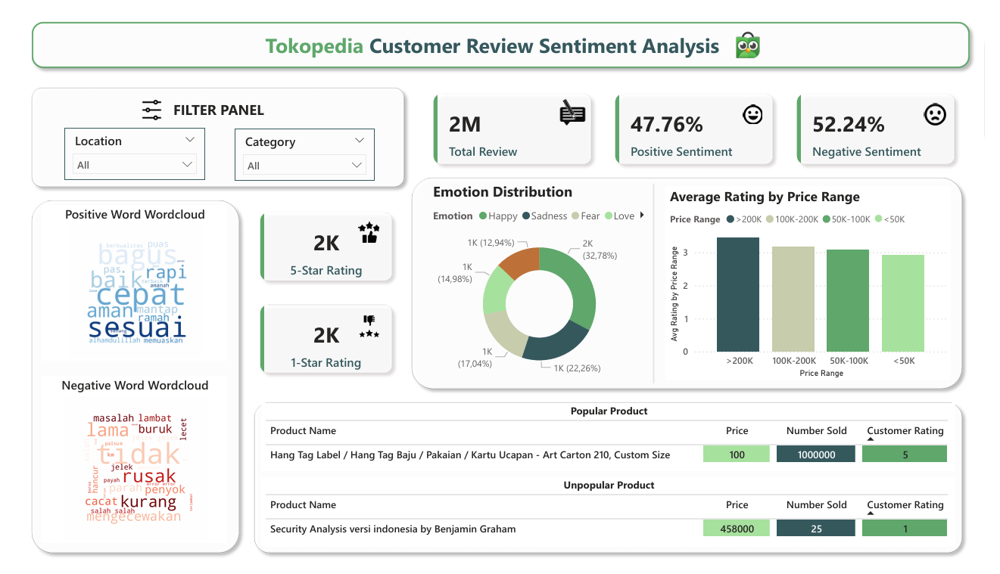

# Tokopedia-Sentiment-Analysis-Dashboard
Repository for Tokopedia Customer Review Sentiment Analysis     

📌 Deskripsi  
Dashboard ini menganalisis sentimen ulasan pelanggan di Tokopedia. Dataset yang digunakan pada dashboard ini diambil dari kaggle website https://www.kaggle.com/datasets/jocelyndumlao/prdect-id-indonesian-emotion-classification. Dashboard ini dibuat dengan menggunakan Power BI untuk visualisasi data dan python untuk preprocessing data.     

📊 Fitur-Fitur Dashboard  
Sentiment Distribution 📊 → Persentase sentimen positif & negatif.   
Top Emotions 😊😢😡 → Pie chart emosi pelanggan.   
Word Cloud ☁️ → Kata-kata paling sering muncul di ulasan positif & negatif.  
Rating & Price Analysis 💰 → Hubungan harga produk dengan rating.  
Popular & Unpopular Products 📈📉 → Produk dengan rating & penjualan tertinggi/rendah.    

🖼️ Screenshot Dashboard  
   

📌 Tools yang Digunakan  
Power BI → Untuk visualisasi data.  
Python (Pandas, WordCloud, Matplotlib) → Untuk preprocessing teks & analisis word cloud.  
DAX (Data Analysis Expressions) → Untuk perhitungan metrik di Power BI.    

⚙️ Cara Menggunakan Dashboard
1. Clone repository ini  
2. Buka file .pbix di Power BI Desktop  
